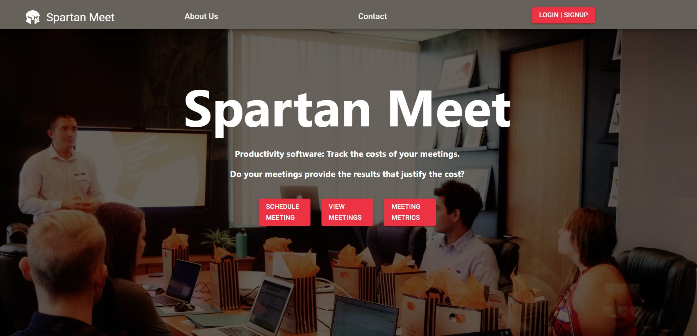
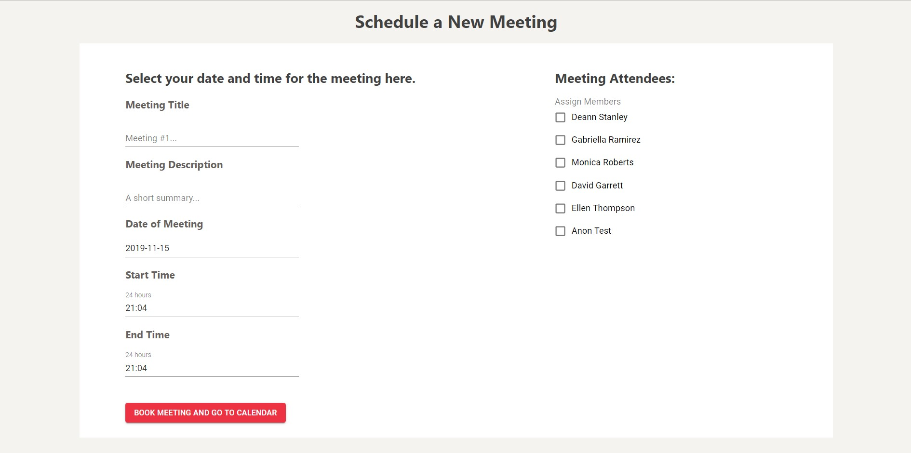
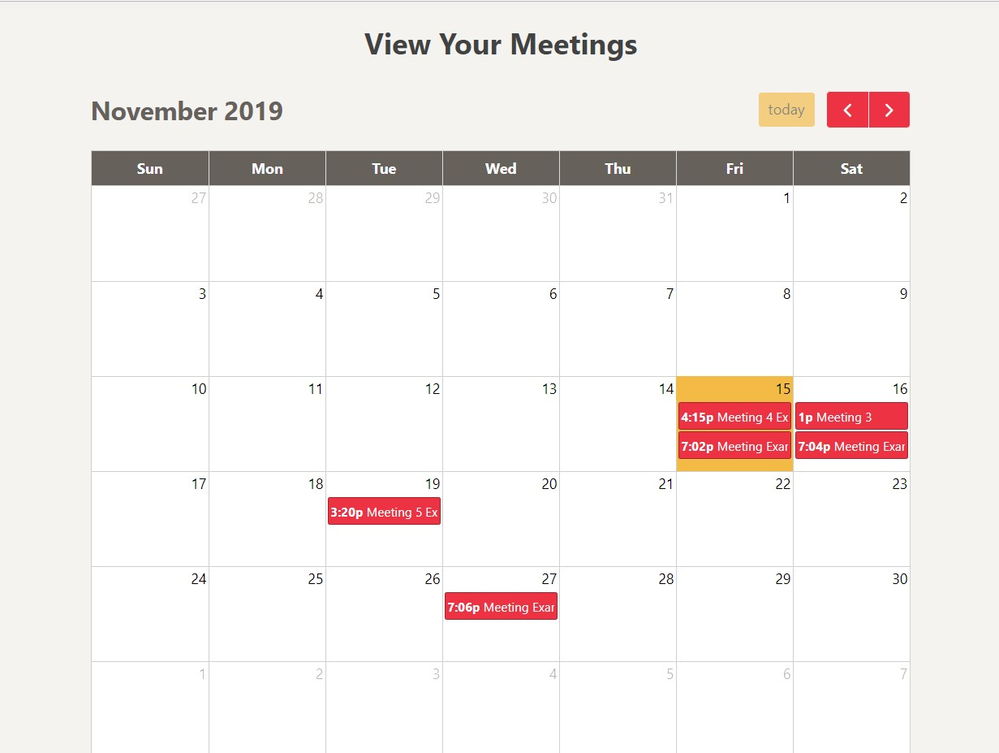

# Spartan Meet

## About This Project

Spartan Meeting is an app that allows users to book meetings with other users in their company, track their meetings in a calendar, and track the cost of meetings based on the hourly cost of each user in the meeting and the length of the meeting.

The requirement for this project was to build a site which used the following technologies: 
* Use a Node and Express Web Server
* Be backed by a MySQL or MongoDB Database with a Sequelize or Mongoose ORM
* Have both GET and POST routes for retrieving and adding new data
* Be deployed using Heroku (with Data)
* Utilize at least two new libraries, packages, or technologies that we haven’t discussed
* Have a polished frontend / UI
* Have folder structure that meets MVC Paradigm
* Must meet good quality coding standards (indentation, scoping, naming)
& Must not expose sensitive API key information on the server.

## Authors

Phil Blanchard, Madeleine Griggs, Paul Unsted

## Demo

Spartan Meeting is deployed to Heroku, please check it out here: [Project 3](https://project-3-heroku.herokuapp.com/ "Project 3 Site")

## Technologies Used

- Javascript
- Node.js
- Express.js - server.
- React.js - Front End Framework.
- Express Sessions - Used to create the session cookie on login.
- Passport - Local Strategy, used for authentication.
- MySQL - Database.
- Sequelize - ORM.
- Moment - Used for processing dates and times.
- Material UI - React UI Framework, used for interaction and styling.
- Material UI Pickers - Supplemental library used for date and time pickers.
- FullCalendar.io - Javascript Calendar with connectors for react.
- Heroku - for example deployment.
- HTML5 and CSS3

## Screenshots

### Main Page

### Create New Meeting

### Calendar View

